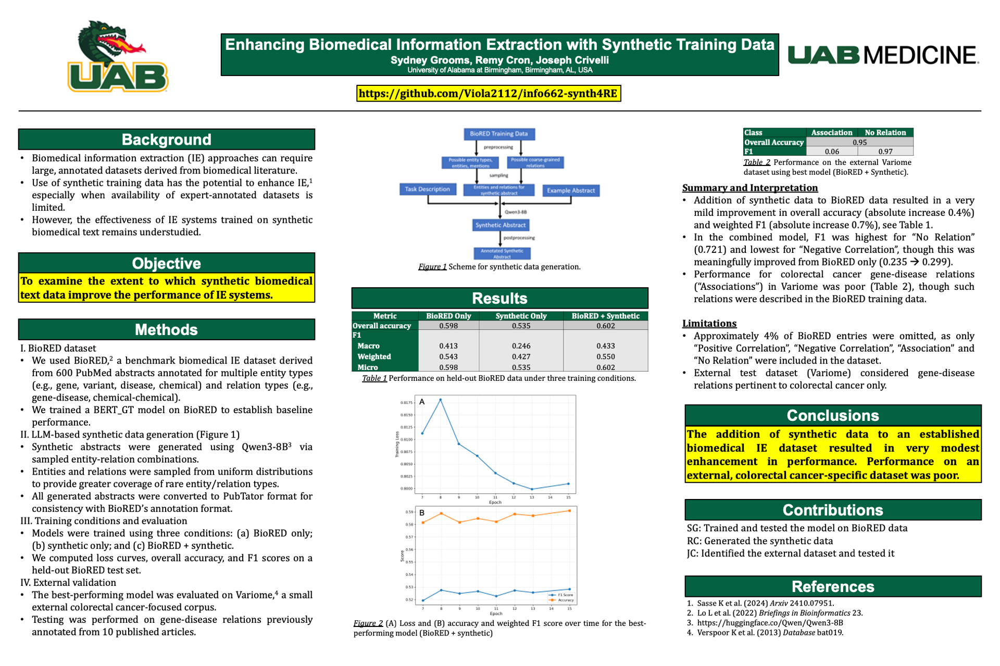

# info662-synth4RE
Group project for INFO 662

# Synthetic data generation

## Step 0: Install environment for downloader and synthetic data generation

Create the environment for downloading the Qwen3-8B model and generating
synthetic data as follows:
```bash
conda create -n synth-gen python=3.11 pip
conda activate synth-gen
pip install -r requirements.txt
```
Note that the conda environemnt for synthetic generation is different than the
conda environment for training the BERT_GT model.

## Step 1: Download Qwen3-8B
Create a folder Qwen3-8B/ in the working directory on Cheaha.
Run the following command to perform the download:
```
sbatch downloader.sh
```
The download may take a few minutes. You can check on progress
using the "sacct" command from command line, since this creates
and submits a new job to the supercomputer.

## Step 2: Generate synthetic data
Open the Jupyter Notebook "Generate_Synthetic.ipynb" and make sure the kernel
is assigned to "synth-gen". Run all cells and make sure to keep the 
connection running for about 12 hours. This should produce SynthTrain.PubTator, 
the synthetic data in the PubTator format, and synth_faithfullness.csv, which documents
how well the LLM follows instructions about number of mentions to generate, in the data/ directory.

---
# BERT_GT Model Environment Installation 
 **Reference: Claude.Ai Chatlog**
- https://claude.ai/share/0111ec41-3c6b-4ea2-8928-e80da01faf9d

### Step 1: Set Up Python Environment

**Option A: Using Conda (Recommended)**
```bash
conda create -n bert-gt python=3.9
conda activate bert-gt
```

**Option B: Using venv**
```bash
python -m venv bert-gt-env
source bert-gt-env/bin/activate  # Linux/Mac
# or
bert-gt-env\Scripts\activate  # Windows
```
### Step 2: clone notebook and data 
```bash
git clone https://github.com/Viola2112/info662-synth4RE .
```

# BERT_GT Model Run Set-up 

For more details, read [BERT_GT_NOTEBOOK_USAGE_MANUAL_v12_FINAL.md] (https://github.com/Viola2112/info662-synth4RE/blob/main/BERT_GT_NOTEBOOK_USAGE_MANUAL_v12_FINAL.md)

## Quick Start

### Three-Step Quick Start

1. **Open Notebook**
   ```bash
   jupyter notebook BERT_GT_Notebook_v3.ipynb
   ```

2. **Update File Paths (Cell 19)**
   ```python
   TRAIN_DATA_PATH = './data/Train.PubTator'  # ← Update these!
   DEV_DATA_PATH = './data/Dev.PubTator'
   TEST_DATA_PATH = './data/Test.PubTator'
   ```

3. **Run All Cells**
   - Click: **Cell → Run All**
   - Testing mode: ~20-30 minutes
   - Full training: ~30-40 hours (1 GPU)

### Testing Mode (Quick Verification)

Keep `TESTING = False` in Cell 19 to start:
```python
TESTING = False  # Change to True for quick test
```

For quick testing (20-30 minutes):
```python
TESTING = True
MAX_DOCS = 100    # Load 100 documents
NUM_EPOCHS = 3    # Quick training
BATCH_SIZE = 4    # Small batch
```

### Expected Results

**Testing Mode (100 docs, 3 epochs):**
- F1 Score: ~60-65%
- Accuracy: ~70-75%
- Training time: 20-30 minutes

**Full Training (400+ docs, 30 epochs):**
- F1 Score: ~70-73%
- Accuracy: ~78-82%
- Training time: 30-40 hours (RTX 3080)

---

## First Time Full Setup

**Step 1: Install Everything (Cells 1-7)**

Run cells 1-7 in order:
1. Cell 1: Read title
2. Cell 2: Read section header
3. Cell 3: Install PyTorch (takes ~2-3 minutes)
4. Cell 4: Install other packages (takes ~1-2 minutes)
5. Cell 5: Check GPU (should show your GPU)
6. Cell 6: Import libraries (takes ~10 seconds)
7. Cell 7: Verify setup (should show PyTorch 2.6.0+cu124)

**Step 2: Review Architecture (Cells 8-17)**

These cells define the model. You can:
- **Just run them**: If you trust the code
- **Read and understand**: If you want to learn how BERT-GT works

Run cells 8-17 in order (takes ~5 seconds total)

**Step 3: Configure (Cell 19) ⭐ CRITICAL**

```python
# UPDATE THESE FILE PATHS!
TRAIN_DATA_PATH = './data/Train.PubTator'  # ← Your path here
DEV_DATA_PATH = './data/Dev.PubTator'      # ← Your path here
TEST_DATA_PATH = './data/Test.PubTator'    # ← Your path here

# For first run, use testing mode
TESTING = True  # ← Set to True for quick test
```

Run cell 19

**Step 4: Load Data (Cells 20-24)**

Run cells 20-24 in order:
- Takes ~2-5 minutes for testing mode
- Takes ~5-10 minutes for full training mode

**Step 5: Initialize Model (Cell 26)**

Run cell 26:
- Takes ~30 seconds to download and initialize BioBERT

**Step 6: Train Model (Cell 27)**

Run cell 27:
- Testing mode: ~20-30 minutes
- Full training: ~30-40 hours (1 GPU)

## Run All Cells at Once

**Quick Method:**
1. Update file paths in Cell 19
2. Set `TESTING = True` (for first run)
3. Click: **Cell → Run All**
4. Wait ~30 minutes (testing) or ~30-40 hours (full)

### Resume Interrupted Training

If training was interrupted:

**Option 1: Just Rerun Cell 27 (Recommended) ⭐**
```python
# Cell 27 automatically resumes from latest checkpoint!
# Just run the cell again
```

**Option 2: Check Checkpoints First**
```python
# Run this in a new cell to see checkpoints
import os
if os.path.exists('checkpoints'):
    print("Checkpoints found:")
    for f in sorted(os.listdir('checkpoints')):
        if f.endswith('.pt'):
            print(f"  {f}")
else:
    print("No checkpoints found")
```

**Option 3: Resume from Specific Checkpoint**
```python
# In Cell 27, uncomment and modify:
training_stats = train_bert_gt_with_checkpoints(
    ...,
    resume='checkpoints/checkpoint_epoch_15.pt'  # ← Specific checkpoint
)
```

### Training Workflow

```
1. First Run (Testing)
   ├─ Set TESTING = True
   ├─ Run All Cells
   ├─ Wait ~30 minutes
   └─ Verify F1 ~60-65%

2. Full Training
   ├─ Set TESTING = False
   ├─ Run Cell 19 (config)
   ├─ Run Cells 20-24 (data loading)
   ├─ Run Cell 26 (model init)
   ├─ Run Cell 27 (training)
   └─ Wait ~30-40 hours

3. If Interrupted
   ├─ Just rerun Cell 27
   └─ Auto-resumes from latest checkpoint

4. Evaluation
   ├─ Run Cell 29 (test evaluation)
   ├─ Run Cell 31 (visualizations)
   ├─ Run Cell 33 (save stats)
   └─ Run Cells 35-36 (detailed metrics)
```


# External dataset (Variome): BioC to PubTator Conversion 

***Generated with assistance from Claude.AI

## Overview

This converts the Variome dataset from BioC XML format to PubTator format 

## Dataset

- **Source**: Variome corpus (BioC XML format)

Available at: github.com/hu-ner/hunflair-corpora/tree/main

## Files

| File | Description |
|------|-------------|
| `bioc_to_pubtator.py` | Conversion script from BioC XML to PubTator format |
| `variome_bioc.xml` | Original Variome dataset in BioC format |
| `variome_output.pubtator` | Converted dataset in PubTator format |

## Installation

```bash
pip install torch transformers tqdm scikit-learn pandas
```

## Usage

### 1. Convert BioC XML to PubTator Format

```python
from bioc_to_pubtator import parse_bioc_to_pubtator

parse_bioc_to_pubtator('variome_bioc.xml', 'variome_output.pubtator')
```

Or from command line:
```bash
python bioc_to_pubtator.py variome_bioc.xml variome_output.pubtator
```

### 2. PubTator Output Format

```
PMID|t|Title text
PMID|a|Abstract text
PMID    start    end    text    type    annotation_id
PMID    relation_type    arg1_id    arg2_id
```

Example:
```
02435117|t|Conclusion
02435117|a|By analyzing a large series of tumors from Swedish patients...
02435117	251	257	CTNNB1	gene	T1
02435117	213	224	parathyroid	body-part	T4
02435117	225	231	tumors	disease	T5
02435117	Association	T4	T5
```

